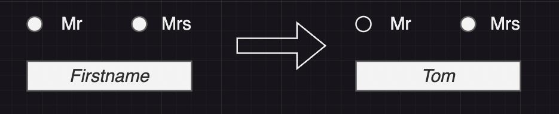

# Lets create our first Web-Component
your task is to create a Web-Component which is supposed to determine the gender of a person.

> use the [setup](./SETUP.md) documentation to get started. instead of "the-example" name the component as you like e.g. gender-recognizer

> The UI could look like that at the end <br><br>


<br><br>
1. add a field to your UI which asks for the firstname of the person
2. in the background we make a call to the [genderize api](https://genderize.io/), which tells us the gender that the api think the name has. The result will look like:
```javascript
{
    "count": 698532,
    "gender": "male",
    "name": "tom",
    "probability": 1
}
```
3. If the probability is about at least 80 percentage we automatically select the gender in the radiobutton group.